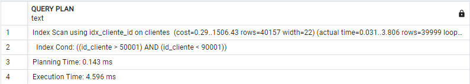
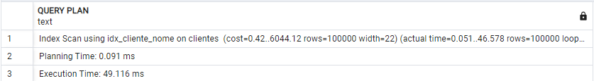

## Tabela Clientes

> Nessa tabela foram utilizadas consultas em ambos os campos, mas principalmente no campo nome. O campo nome deve ser indexado pois isso facilita buscas exatas e principalmente a ordenação.

### Condicional 'WHERE'

> Query utilizada

```postgresql
EXPLAIN ANALYZE SELECT * FROM clientes WHERE nome = 'Clientebf65b59951';
```

#### Sem index


#### Index B-TREE


#### Index B-TREE com Cluster


#### Index HASH


> Na busca exata vimos todos os tipos de Index apresentando melhorias quanto ao anterior, sendo o que mais se destacou foi o index HASH, ideal para buscas exatas.

### Operadores Aritiméticos

> Query utilizada

```postgresql
EXPLAIN ANALYZE SELECT * FROM clientes WHERE id_cliente > 50001 AND id_cliente < 90001;
```

#### Sem index


#### Index B-TREE



#### Index B-TREE com Cluster


#### Index HASH

> A consulta não suporta o operador HASH

> Na busca com intervalo vemos que o Index Hash não é suportado e a diferença entre uma busca indexada ou não nesse tipo de consulta é praticamente irrelevante, chegando a aumentar o tempo em alguns casos.

### GROUP BY

> Query utilizada

```postgresql
EXPLAIN ANALYZE SELECT * FROM clientes GROUP BY id_cliente;
```

#### Sem index


#### Index B-TREE


#### Index B-TREE com Cluster


#### Index HASH

> Na busca com GROUP BY vemos que o Index Hash não é suportado e a diferença entre uma busca indexada ou não nesse tipo de consulta é praticamente irrelevante, chegando a aumentar o tempo em alguns casos.

### ORDER BY

> Query utilizada

```postgresql
EXPLAIN ANALYZE SELECT * FROM clientes ORDER BY nome;
```

#### Sem index


#### Index B-TREE



#### Index B-TREE com Cluster


#### Index HASH

> A consulta não suporta o operador HASH

> Na busca com ORDER BY vemos que o Index Hash não é suportado e a diferença entre uma busca indexada ou não nesse tipo de consulta é muito relevante, diminuindo mais que 100x o tempo necessário.

---

- Assim, podemos concluir que uma indexação no campo nome da tabela clientes é essencial para velocidade das consultas nessa tabela.
- Já no index, por ser serial, não se faz necessário.

---

## Tabela PEDIDOS

> Nessa tabela foram utilizadas consultas em todos os campos menos o id_cliente, mas principalmente no campo valor_total. O campo valor_total deve ser indexado pois isso facilita buscas exatas e principalmente a ordenação.

### Condicional 'WHERE'

> Query utilizada

```postgresql
EXPLAIN ANALYZE SELECT * FROM pedidos WHERE data_pedido = '2025-01-17';
```

#### Sem index


#### Index B-TREE


#### Index B-TREE com Cluster


#### Index HASH

> A consulta não suporta o operador HASH

> Na busca com WHERE utilizando data vemos que o Index Hash não é suportado e a diferença entre uma busca indexada ou não nesse tipo de consulta é relevante, com destaque para a B-TREE sem cluster.

### Operadores Aritiméticos

> Query utilizada

```postgresql
EXPLAIN ANALYZE SELECT * FROM pedidos WHERE valor_total > 3500 AND valor_total < 4000;
```

#### Sem index


#### Index B-TREE


#### Index B-TREE com Cluster


#### Index HASH

> A consulta não suporta o operador HASH

> Na busca com operadores vemos que o Index Hash não é suportado e a diferença entre uma busca indexada ou não nesse tipo de consulta é praticamente relevante, com destaque para o Index B-TREE com cluster.

### GROUP BY

> Query utilizada

```postgresql
EXPLAIN ANALYZE SELECT * FROM pedidos GROUP BY id_pedido;
```

#### Sem index


#### Index B-TREE


#### Index B-TREE com Cluster


#### Index HASH

> A consulta não suporta o operador HASH

> Na busca com GROUP BY vemos que o Index Hash não é suportado e a diferença entre uma busca indexada ou não nesse tipo de consulta é praticamente irrelevante, chegando a aumentar o tempo em alguns casos.

### ORDER BY

> Query utilizada

```postgresql
EXPLAIN ANALYZE SELECT * FROM pedidos ORDER BY valor_total;
```

#### Sem index


#### Index B-TREE


#### Index B-TREE com Cluster


#### Index HASH

> A consulta não suporta o operador HASH

> Na busca com ORDER BY vemos que o Index Hash não é suportado e a diferença entre uma busca indexada ou não nesse tipo de consulta é relevante, com destaque para o Index B-TREE com cluster.

---

- Assim, podemos concluir que uma indexação no campo data_pedido é relevante, principalmente a fim de ordernar possíveis buscas.
- A indexação no ID, como visto no caso anterior não gera diferença, por se tratar de um serial.
- Outra indexação válida é no campo valor_total, facilitando comparações, buscas, ordenações e etc.

---

## Tabela ITENS_PEDIDO

### Condicional 'WHERE'

> Query utilizada

```postgresql
EXPLAIN ANALYZE SELECT * FROM itens_pedido WHERE preco = 3722.00;
```

#### Sem index


#### Index B-TREE


#### Index B-TREE com Cluster


#### Index HASH


> Na busca exata com WHERE a diferença entre uma busca indexada ou não nesse tipo de consulta é relevante, com destaque para a tabela hash que é ideal para esse tipo de busca.

### Operadores Aritiméticos

> Query utilizada

```postgresql
EXPLAIN ANALYZE SELECT * FROM itens_pedido WHERE preco > 3500 AND preco < 4200;
```

#### Sem index


#### Index B-TREE


#### Index B-TREE com Cluster


#### Index HASH

> A consulta não suporta o operador HASH

> Na busca com Intervalo vemos que o Index Hash não é suportado e a diferença entre uma busca indexada ou não nesse tipo de consulta gera uma leve melhora, com destaque para o index B-TREE com cluster.

### GROUP BY

> Query utilizada

```postgresql
EXPLAIN ANALYZE SELECT * FROM itens_pedido GROUP BY id_item;
```

#### Sem index


#### Index B-TREE


#### Index B-TREE com Cluster


#### Index HASH

> A consulta não suporta o operador HASH

> Na busca com GROUP BY vemos que o Index Hash não é suportado e a diferença entre uma busca indexada ou não nesse tipo de consulta é praticamente irrelevante, chegando a aumentar o tempo em alguns casos.

### ORDER BY

> Query utilizada

```postgresql
EXPLAIN ANALYZE SELECT * FROM itens_pedido ORDER BY quantidade;
```

#### Sem index


#### Index B-TREE


#### Index B-TREE com Cluster


#### Index HASH

> A consulta não suporta o operador HASH

> Na busca com ORDER BY vemos que o Index Hash não é suportado e a diferença entre uma busca indexada ou não nesse tipo de consulta é relevante, com destaque para o index B-TREE com cluster.

---

- Assim, podemos concluir que uma indexação no campo preco é relevante, principalmente a fim de ordernar possíveis buscas e fazer comparações.
- A indexação no ID, como visto no caso anterior não gera diferença, por se tratar de um serial.
- Outra indexação válida é no campo quantidade, facilitando comparações, buscas, ordenações e etc.
- O campo descricao, pensando em uma lógica de e-commerce, também não seria necessário um index, pois ele é necessário apenas em uma busca por ID.

---
